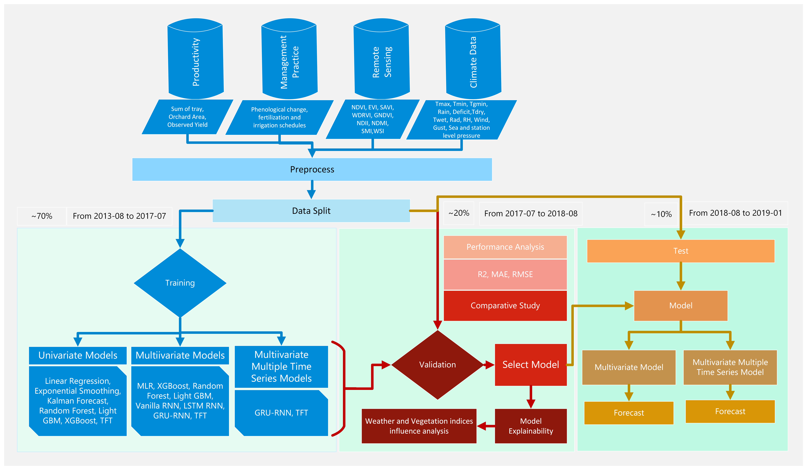
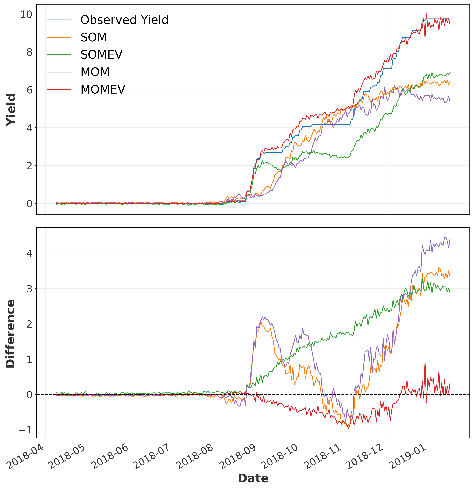
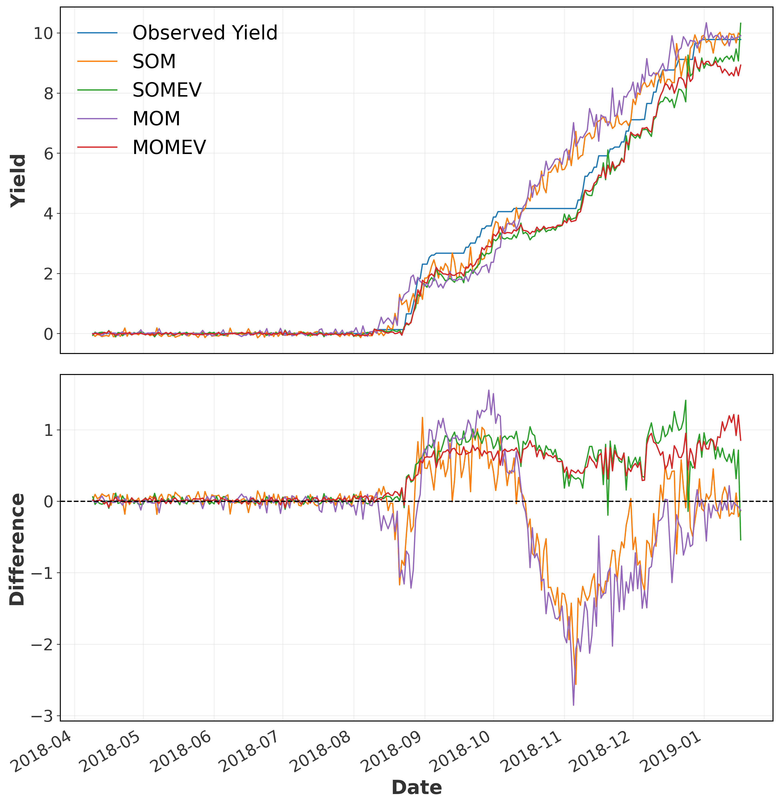

# Day Framework
This folder includes the python codes for the implementation of the methods covered in the article DAY: Data-Driven Avocado Yield Forecasting Machine Learning Framework" by Simna Rassak, The University of Waikato and ESR.

The DAY framework employs machine-learning techniques to integrate weather data, vegetation indices, historical yield information, and management practices for forecasting daily avocado yield volume. The framework consists of six key processes, data-data acquisition, data pre-processing, model training, model validation and comparison, selected model testing and feature influence and yield variance. Figure:ML_Framework illustrates the architecture of DAY Framework.

I have conducted a comprehensive comparison of various univariate and multivariate models for time series forecasting. The univariate models evaluated include Linear Regression, Exponential Smoothing, Kalman Forecaster, Random Forest, XGBoost, and Temporal Fusion Transformer (TFT). For the multivariate analysis, I examined Multivariate Regression, Bayesian Ridge Regression, Random Forest, XGBoost, Vanilla Recurrent Neural Network (Vanilla-RNN), Long Short-Term Memory Recurrent Neural Network (LSTM-RNN), Gated Recurrent Unit Recurrent Neural Network (GRU-RNN),TFT.  Additionally, I also included RNN and TFT model’s global modeling characteristics. 

The figure below shows the forecasting performed using GRU-RNN

The figure below shows the forecasting performed using TFT

The list of the files and their usage are given below:
1. preprocess_avo.py - to preprocess the dataset, however customize according to the dataset
2. univariate_model.py -comparative study of univariate models
3. multivariate_model.py-comparative study of multivariate model (data with environment features)
4. RNN_forecastmodel.py-use to perform the model mentioned in paper (SOM,SOMEV,MOM,MOMEV), please select the model based on experiment
5. TFT_forecastmodel.py-use to perform the model mentioned in paper (SOM,SOMEV,MOM,MOMEV), please select the model based on experiment
